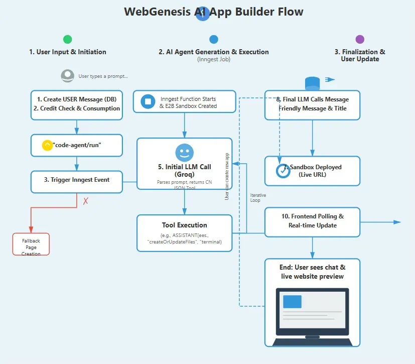

# WebGenesis---AI-SaaS-Application

WebGenesis is an innovative AI-powered Software-as-a-Service (SaaS) platform designed to help businesses and developers streamline the creation, deployment, and management of intelligent web applications. Built on modern cloud architecture, WebGenesis provides scalable AI tools and APIs for automation.

## 🚀 Features

- **AI-Powered Development**: Leverage advanced AI models to automate web application development
- **Intelligent Deployment**: Smart deployment pipelines with automated optimization
- **Scalable Architecture**: Built on modern cloud infrastructure for enterprise-grade scalability
- **Developer-Friendly APIs**: Comprehensive API suite for seamless integration
- **Real-time Management**: Monitor and manage your applications in real-time
- **Automated Workflows**: Streamline your development process with intelligent automation

## 📸 Screenshots

### Homepage

*WebGenesis landing page and main interface*

### Output

*AI-generated results and application output*

### Workflow

*Complete workflow architecture and process flow*

## 🛠️ Tech Stack

- **Frontend**: [Your frontend framework]
- **Backend**: [Your backend technology]
- **AI/ML**: [AI frameworks used]
- **Database**: [Database technology]
- **Cloud**: [Cloud platform]
- **APIs**: RESTful/GraphQL

## 📦 Installation

```bash
# Clone the repository
git clone https://github.com/yashmishra11/WebGenesis-AI-SaaS-Application.git

# Navigate to the project directory
cd WebGenesis-AI-SaaS-Application

# Install dependencies
npm install

# Set up environment variables
cp .env.example .env

# Run the application
npm start
```

## 🔧 Configuration

Create a `.env` file in the root directory with the following variables:

```env
API_KEY=your_api_key
DATABASE_URL=your_database_url
CLOUD_SERVICE_KEY=your_cloud_service_key
AI_MODEL_ENDPOINT=your_ai_endpoint
```

## 💻 Usage

```javascript
// Example usage of WebGenesis API
import { WebGenesis } from 'webgenesis-sdk';

const app = new WebGenesis({
  apiKey: 'your-api-key'
});

// Create a new AI-powered application
await app.create({
  name: 'My App',
  features: ['ai-chat', 'automation']
});
```

## 🌟 Key Benefits

- **Faster Time to Market**: Deploy intelligent applications in minutes, not months
- **Cost-Effective**: Reduce development costs with AI automation
- **Scalable Solutions**: Grow from startup to enterprise with ease
- **Developer Experience**: Intuitive tools designed for modern development workflows

## 📚 Documentation

For detailed documentation, visit [your-documentation-link]

## 🤝 Contributing

Contributions are welcome! Please follow these steps:

1. Fork the repository
2. Create a new branch (`git checkout -b feature/amazing-feature`)
3. Commit your changes (`git commit -m 'Add some amazing feature'`)
4. Push to the branch (`git push origin feature/amazing-feature`)
5. Open a Pull Request

## 📄 License

This project is licensed under the [MIT License](LICENSE)

## 👥 Team

- **Yash Mishra** - [@yashmishra11](https://github.com/yashmishra11)

## 📞 Contact

For questions or support, please reach out:
- Email: [your-email@example.com]
- GitHub Issues: [Create an issue](https://github.com/yashmishra11/WebGenesis-AI-SaaS-Application/issues)

## 🙏 Acknowledgments

- Thanks to all contributors who have helped shape WebGenesis
- Special thanks to the open-source community

---

**⭐ If you find this project useful, please consider giving it a star!**
